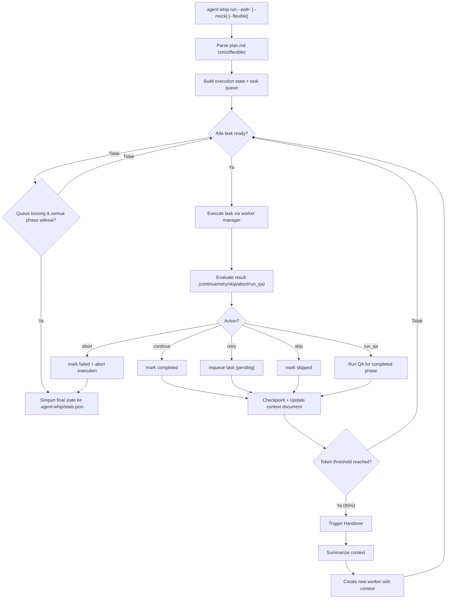
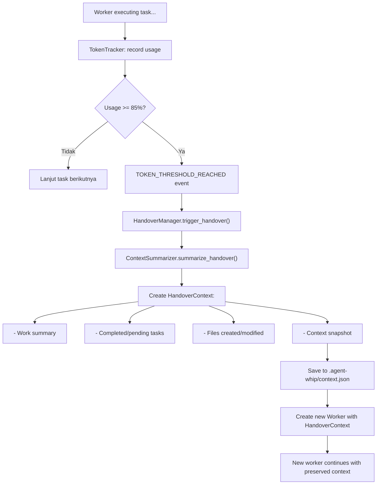
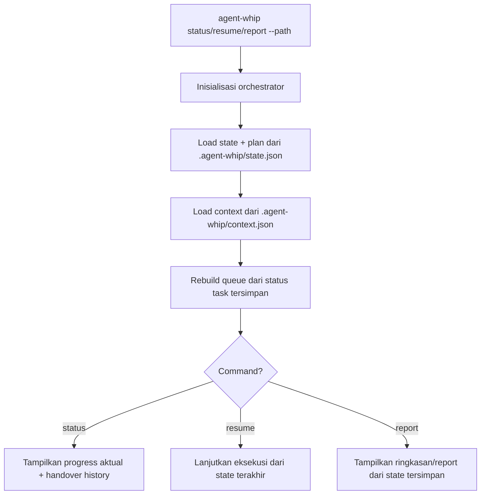

# Flow Terbaru AgentWhip

**Update:** 2026-04-23

Dokumen ini menjelaskan flow runtime aktual setelah perbaikan retry, resume, state handling, dan **handover**.

---

## 1. Flow `run`



### Keputusan hasil task
- `success` -> `completed`
- `retry` -> kembali ke `pending` (tanpa crash `KeyError`)
- `skip` -> `skipped`
- `abort` -> `failed` + status eksekusi `aborted`

---

## 2. Flow `Handover` (Fitur Baru)



### Handover Context Structure
```python
HandoverContext(
    handover_id: str,              # Unique ID (ho_YYYYMMDD_HHMMSS_xxxxxxxx)
    timestamp: datetime,            # When handover occurred

    # Project context
    project_name: str,
    project_path: str,

    # Execution context
    current_phase: str,
    current_task: str,
    phase_progress: float,          # 0.0 - 1.0

    # Work summary (AI-generated)
    work_summary: str,              # Compact summary of work done
    tasks_completed: list[str],     # Task IDs
    tasks_pending: list[str],       # Task IDs
    tasks_failed: list[str],        # Task IDs

    # Artifacts
    files_created: list[str],
    files_modified: list[str],
    decisions_made: list[DecisionRecord],

    # Context snapshot (compact state)
    context_snapshot: dict,

    # Metadata
    from_worker_id: str,
    tokens_used: int,
    session_duration: float,
)
```

---

## 3. Flow `status`, `resume`, `report`



---

## 4. File State yang Dipakai

| File | Deskripsi |
|------|-----------|
| `.agent-whip/state.json` | State aktif eksekusi |
| `.agent-whip/backup/state_*.json` | Backup state |
| **`.agent-whip/context.json`** | **Context document + handover history (BARU)** |

---

## 5. Konfigurasi Handover

```yaml
# agent-whip.yml

handover:
  enabled: true
  token_threshold: 0.85  # Trigger di 85%

  # Per-worker settings
  claude:
    max_tokens_per_session: 200000
    enable_auto_summarize: true

  # Context preservation
  context_document_enabled: true
  context_document_path: ".agent-whip/context.json"
  max_context_entries: 1000

  # Summarization
  max_summary_length: 10000
  include_artifacts: true
  include_decisions: true
```

---

## 6. Ringkasannya

Flow baru memastikan:
1. **Retry aman dan stabil** - task gagal di-retry tanpa crash
2. **Resume/status/report konsisten** - semua membaca sumber state yang sama
3. **Queue recovery** - dipulihkan dari status task tersimpan
4. **Progress tracking akurat** - status/progress lebih akurat
5. **Handover otomatis** - worker baru lanjut dengan konteks terjaga (BARU)
6. **Context persistence** - semua keputusan & artifact tercatat (BARU)

---

## 7. Events Terkait Handover

| Event | Trigger |
|-------|---------|
| `TOKEN_USAGE_UPDATED` | Setiap kali worker dipanggil |
| `TOKEN_THRESHOLD_REACHED` | Token >= 85% dari limit |
| `HANDOVER_TRIGGERED` | Handover dimulai |
| `HANDOVER_COMPLETED` | Handover selesai sukses |
| `HANDOVER_FAILED` | Handover gagal |
| `CONTEXT_UPDATED` | Context document di-update |

---

## 8. Command Baru untuk Handover

```bash
# Cek handover history
agent-whip status --path <project> --show-handovers

# Lihat context snapshot
agent-whip context --path <project>

# Export context untuk debugging
agent-whip export-context --path <project> --output context_snapshot.json
```
